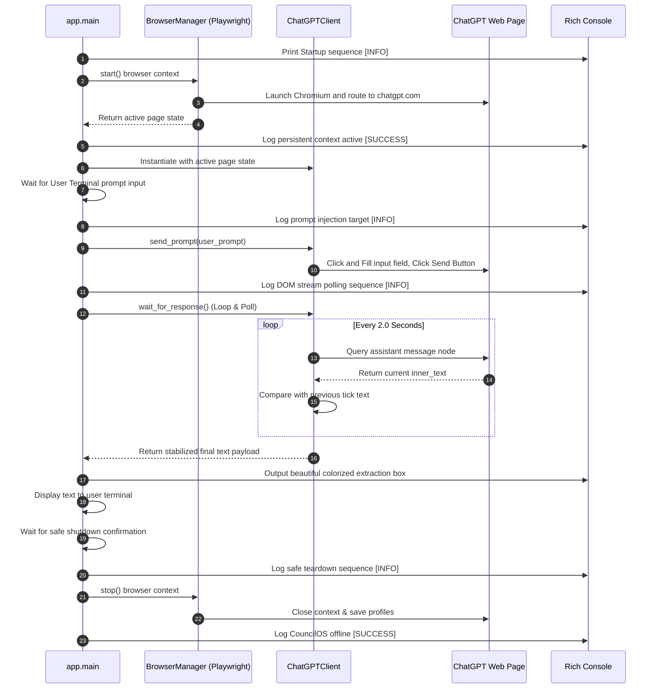

# System Architecture & Design 🏗️

This document describes the structural design of CouncilOS, detailing its multi-agent debate protocols, supporting memory architecture, and its real-time browser-automation execution pipeline.

---

## 🌀 High-Level Architecture

CouncilOS is built upon the concept of **Collaborative Multi-Agent Debates**. The goal is to maximize decision-making quality by organizing agents into structured, multi-role assemblies. In addition to local API-driven agents, the platform incorporates an advanced **Automation Layer** that allows agents to interact dynamically with web-based LLM sessions (e.g., ChatGPT) as execution targets using a Playwright-backed browser engine.

```
                                 ┌────────────────────────┐
                                 │      User Request      │
                                 └───────────┬────────────┘
                                             │
                                             ▼
                                 ┌────────────────────────┐
                                 │    Debate Orchestrator │
                                 └─────┬────────────┬─────┘
                                       │            │
                        ┌──────────────┘            └──────────────┐
                        ▼                                          ▼
               ┌─────────────────┐                        ┌─────────────────┐
               │  Advocate Agent │ ◄────────────────────► │   Critic Agent  │
               │  (Proposes)     │       Debate           │  (Critiques)    │
               └────────┬────────┘      Protocol          └────────┬────────┘
                        │                                          │
                        │ (Queries automated browser LLMs)         │
                        ▼                                          │
               ┌──────────────────┐                                │
               │ Automation Layer │                                │
               │ (Playwright Core)│                                │
               └────────┬─────────┘                                │
                        │                                          │
                        └──────────────┬────────────┬──────────────┘
                                       │            │
                                       ▼            ▼
                                 ┌─────────┐    ┌─────────┐
                                 │ Memory  │    │ Vector  │
                                 │ Log     │    │ DB      │
                                 └────┬────┘    └─────────┘
                                      │
                                      ▼
                                 ┌─────────┐
                                 │ Judge   │
                                 │ Agent   │
                                 └────┬────┘
                                      │
                                      ▼
                                 ┌─────────┐
                                 │ Final   │
                                 │ Verdict │
                                 └─────────┘
```

---

## 🧱 Core Modules

### 1. Agents (`app.agents`)
- **BaseAgent**: Foundation class managing basic message loop, prompt injection, and LLM call logic.
- **Advocate**: Optimized to propose plans, answer user prompts affirmatively, and provide justifications.
- **Critic**: Specialized in finding flaws, edge cases, risks, and logical inconsistencies in proposals.

### 2. Protocols (`app.protocols`)
- Defines rules of order. It manages the phase transitions (e.g., Proposal -> Critique -> Rebuttal -> Judgment).
- Determines how agents access context and memory.

### 3. Memory (`app.memory`)
- **DebateContext**: Ephemeral, structured context storing messages exchanged within the current debate session.
- **EpisodicMemory**: Storage of past debates to let the system learn from past successes/failures.

### 4. Judges (`app.judges`)
- Evaluates transcripts based on safety, completeness, accuracy, and consensus.
- Acts as a termination condition controller.

### 5. Automation Subsystem (`app.automation`) 🚀 [NEW]
The automation subsystem drives external browser interactions to leverage public LLM interfaces directly inside the debate loop.
- **BrowserManager** (`browser_manager.py`):
  - Manages the Playwright asynchronous lifecycle.
  - Launches a persistent Chromium browser context using local profile caching (`profiles/chatgpt`) to preserve session state, session cookies, and login credentials.
  - Automatically captures the active page or creates a new page, keeping a single persistent session active on `https://chatgpt.com`.
- **ChatGPTClient** (`chatgpt_client.py`):
  - Binds to the active Playwright page object and acts as the programmatic controller.
  - **Prompt Injection**: Interacts with the ChatGPT DOM, wait-locates the main prompt input area, highlights/clicks, and fills it with user or agent queries.
  - **DOM Polling & Stream Stabilization**: Polls the DOM at a regular frequency (`2.0s` intervals) to watch the text updates inside the assistant response node (`[data-message-author-role="assistant"]`). Evaluates if text generation has stabilized by matching the content between sequential ticks, preventing premature content extraction during long-form token streaming.
- **Selectors Registry** (`selectors.py`):
  - Centralizes DOM target elements to ensure resilience. If ChatGPT updates its UI structure, only this registry needs updates.
  - *Current configuration*:
    - `prompt_box`: `'textarea[placeholder="Ask anything"]'`
    - `send_button`: `'button[data-testid="send-button"]'`

### 6. System Utilities (`app.utils`) 🚀 [NEW]
- **Rich Logger** (`logger.py`):
  - Uses the `rich.console` package to deliver beautiful terminal UI tracking.
  - Distinguishes logs into colorized output categories: `[INFO]` (yellow), `[SUCCESS]` (green), `[WARN]` (red), and structured extraction wrappers to make local debugging human-friendly and elegant.

---

## 🔁 Real-Time Flow & Execution Lifecycle

When launching CouncilOS (`app.main.py`), the execution sequence occurs as follows:


